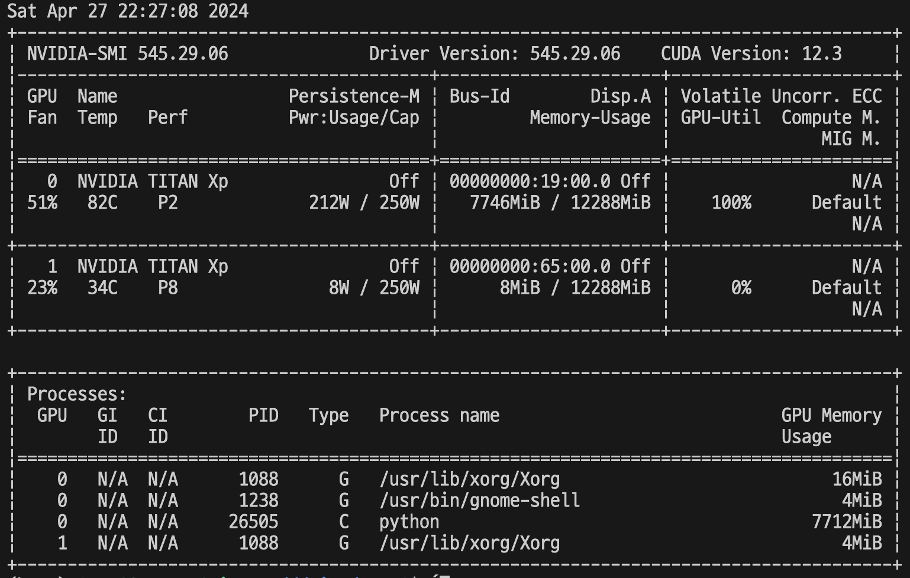
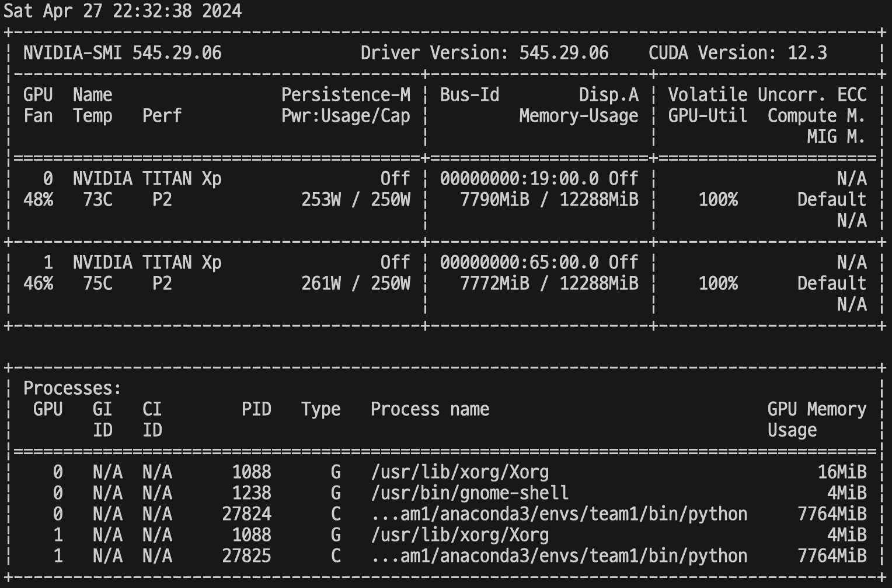

# PyTorch-Multi-GPU-Tutorials

PyTorch Multi-GPU Tutorials 

using **torch.nn.parallel.DistributedDataParallel**

## Setting
- CIFAR10 dataset
- ResNet50 

## Hardware
2 * NVIDIA TITAN XP (12GB VRAM)

## GPU Usage

### singlegpu.py

   

### multipgu.py

